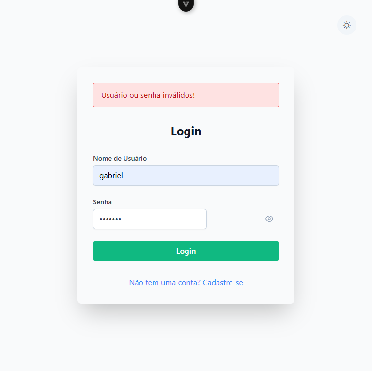
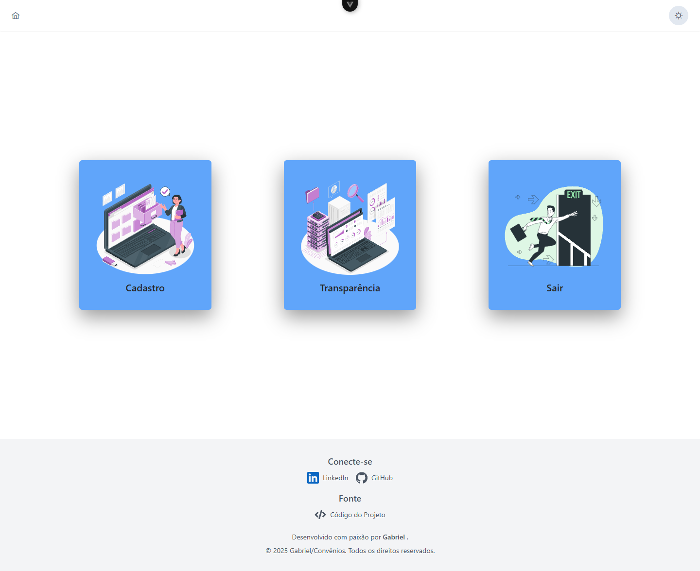
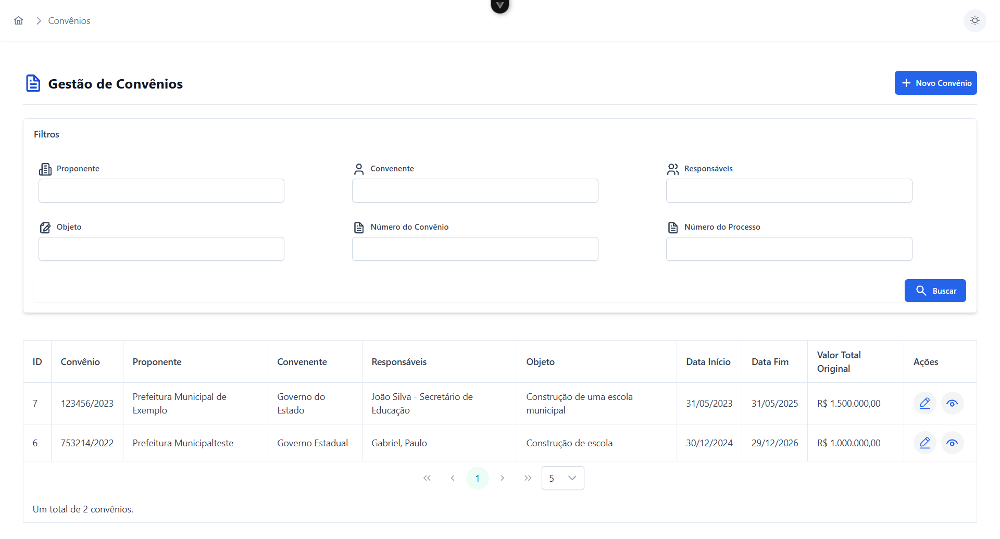
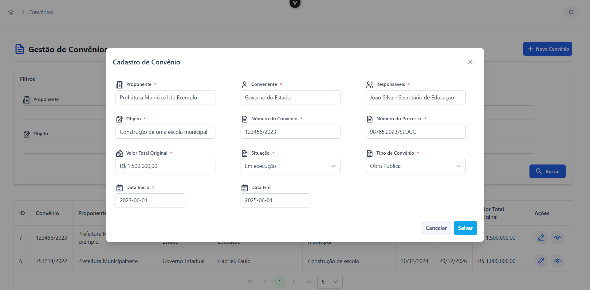
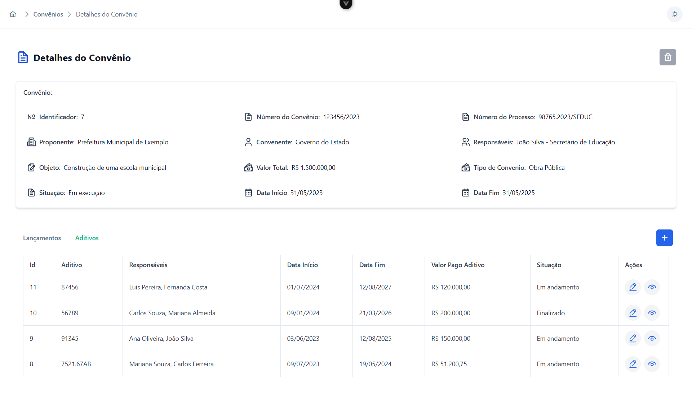
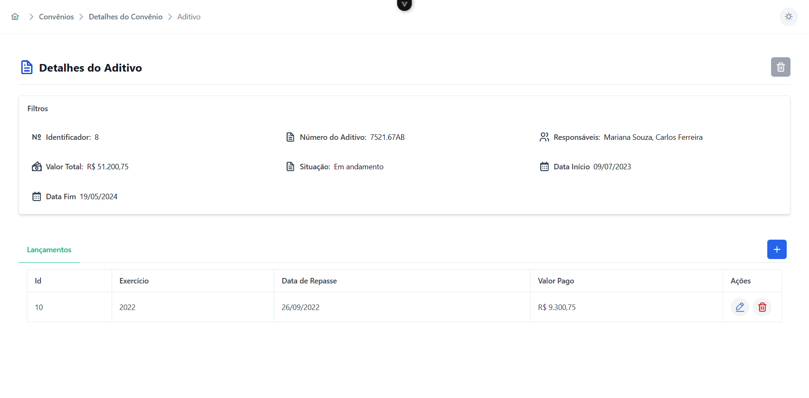

# 🚀 Frontend Gerência

> Sistema administrativo para **gestão de convênios**, aditivos e repasses exibidos na plataforma pública de transparência.

---

## 🎯 Objetivo

Este sistema foi criado para uso **exclusivo de administradores** com o intuito de alimentar e manter atualizadas as informações exibidas na versão pública (**Frontend Transparência**).

---

## 🛠️ Sobre este sistema

O **Frontend Gerência** permite o gerenciamento completo dos seguintes dados:

- Convênios
- Aditivos
- Repasses (lançamentos)
- Proponentes

Esses dados são consumidos pela API e apresentados ao público no sistema Transparência.

---

## ⚙️ Funcionalidades

✅ Login com autenticação  
✅ Cadastro, edição e exclusão de registros  
✅ Validação de formulários  
✅ Roteamento com controle de sessão  
✅ Integração com API REST via Axios

---

## 📱 Responsividade

A aplicação é **totalmente responsiva**, com experiência fluida em:

- 📱 Celulares
- 💻 Computadores
- 📲 Tablets

Construída com **Tailwind CSS**, garantindo usabilidade e estética em qualquer tela.

---

## 🛠️ Tecnologias Utilizadas

- Vue.js 3 (Composition API)
- PrimeVue
- Tailwind CSS
- Axios
- Vue Router
- Pinia

---

## 📚 Referência do Projeto

Este sistema foi inspirado na solução do **Tribunal de Contas do Estado de Roraima**:  
🔗 [https://transparencia.tcerr.tc.br/categorias/convenios/convenios-repassados](https://transparencia.tcerr.tc.br/categorias/convenios/convenios-repassados)

---

# 📸 Screenshots do projeto

## 🔐 Tela de login do sistema

---

## 🏠 Tela inicial do sistema

---

## 📋 Tela de gestão de convênios

---

## 📝 Tela de cadastro de um convênio

---

## 🔍 Tela de detalhes do convênio

---

## 📑 Tela de detalhes de um aditivo do convênio

---

## 🚫 Tela 404

---

👨‍💻 Desenvolvido com 💙 por [Gabriel](https://www.linkedin.com/in/gabrieljauneribera/)
